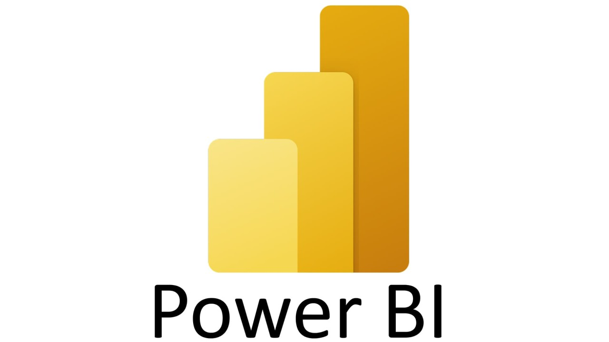
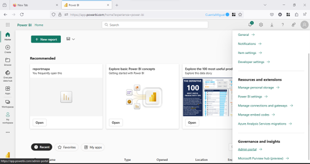
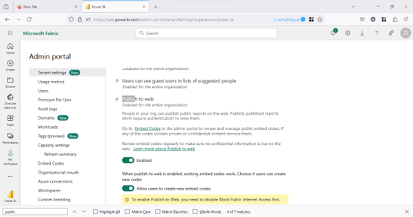

# Getting Started with Create React App

This project was bootstrapped with [Create React App](https://github.com/facebook/create-react-app).

## Available Scripts

In the project directory, you can run:

### `npm start`

Runs the app in the development mode.\
Open [http://localhost:3000](http://localhost:3000) to view it in your browser.

The page will reload when you make changes.\
You may also see any lint errors in the console.

### `npm test`

Launches the test runner in the interactive watch mode.\
See the section about [running tests](https://facebook.github.io/create-react-app/docs/running-tests) for more information.

### `npm run build`

Builds the app for production to the `build` folder.\
It correctly bundles React in production mode and optimizes the build for the best performance.

The build is minified and the filenames include the hashes.\
Your app is ready to be deployed!

See the section about [deployment](https://facebook.github.io/create-react-app/docs/deployment) for more information.

### `npm run eject`

**Note: this is a one-way operation. Once you `eject`, you can't go back!**

If you aren't satisfied with the build tool and configuration choices, you can `eject` at any time. This command will remove the single build dependency from your project.

Instead, it will copy all the configuration files and the transitive dependencies (webpack, Babel, ESLint, etc) right into your project so you have full control over them. All of the commands except `eject` will still work, but they will point to the copied scripts so you can tweak them. At this point you're on your own.

You don't have to ever use `eject`. The curated feature set is suitable for small and middle deployments, and you shouldn't feel obligated to use this feature. However we understand that this tool wouldn't be useful if you couldn't customize it when you are ready for it.

## Learn More

You can learn more in the [Create React App documentation](https://facebook.github.io/create-react-app/docs/getting-started).

To learn React, check out the [React documentation](https://reactjs.org/).

### Code Splitting

This section has moved here: [https://facebook.github.io/create-react-app/docs/code-splitting](https://facebook.github.io/create-react-app/docs/code-splitting)

### Analyzing the Bundle Size

This section has moved here: [https://facebook.github.io/create-react-app/docs/analyzing-the-bundle-size](https://facebook.github.io/create-react-app/docs/analyzing-the-bundle-size)

### Making a Progressive Web App

This section has moved here: [https://facebook.github.io/create-react-app/docs/making-a-progressive-web-app](https://facebook.github.io/create-react-app/docs/making-a-progressive-web-app)

### Advanced Configuration

This section has moved here: [https://facebook.github.io/create-react-app/docs/advanced-configuration](https://facebook.github.io/create-react-app/docs/advanced-configuration)

### Deployment

This section has moved here: [https://facebook.github.io/create-react-app/docs/deployment](https://facebook.github.io/create-react-app/docs/deployment)

### `npm run build` fails to minify

This section has moved here: [https://facebook.github.io/create-react-app/docs/troubleshooting#npm-run-build-fails-to-minify](https://facebook.github.io/create-react-app/docs/troubleshooting#npm-run-build-fails-to-minify)


----------------

# COMO EMBEBER UN REPORTE EN POWER BI EN UN PROYECTO REACT 

Bienvenidos, este es un turorial de como agregar o implementar un reporte hecho en PowerBi en un sitio web de react.

Inicialmente ingresé a descargar PowerBi Desktop [microsoft.com/download Descargar power bi Desktop desde la página oficial de Microsoft"](https://www.microsoft.com/es-es/download/details.aspx?id=58494 "Descargar power bi Desktop desde la página oficial de Microsoft")

Luego creé una cuenta gratuita de 30 dias de Power Bi [app.powerbi.com](https://app.powerbi.com/admin-portal/capacities/capacitiesList/trial?experience=power-bi "Microsoft Fabric") como heerramienta que nos permitirá publicar o subir reportes de Power Bi en la web y que nos retornará una url para embeber dentro del React

Aqui encontrará un tutorial de como crear un cuenta en power bi gratis 
[youtube.com Cómo iniciar sesión en Power BI Service GRATIS 🤩](https://www.youtube.com/watch?v=upZTyad-brY "Cómo iniciar sesión en Power BI Service GRATIS 🤩")

Debe tener en cuenta esta configuración, para ingresar por favor vaya a **Configuraciones > Admin portal** previamente de publicar el reporte de Power Bi



Luego de esto en **Tenant settings > Publish to web** se debe habilitar la opción **Allow users to create new embed codes** para que le permita a los usuario embeber reportes de Power Bi



>Aqui se encuentra un aticulo de Microsoft con un paso a paso de como agregar el código necesario de como embeber un reporte de power bi en React 
[learn.microsoft.com Inserción de un elemento de Power BI en una aplicación react](https://learn.microsoft.com/es-es/javascript/api/overview/powerbi/powerbi-client-react "Inserción de un elemento de Power BI en una aplicación react") **de igualmanera aqui se deja el código para hacerlo**

Se requiere agregar estas librerias para power implementar reportes de Power Bi 
```typescript
import { PowerBIEmbed } from 'powerbi-client-react';
import { models } from 'powerbi-client'; ```


```typescript
function App() {
  return (
    <div className="App">
      <header className="App-header">
        
        <PowerBIEmbed
          embedConfig = {{
            type: 'report',   
            id: "b8cecad6-e1e5-4a4a-a40b-d8620682492c",
            embedUrl: '',
            accessToken: '',
            tokenType: models.TokenType.Embed,
            settings: {
              panes: {
                filters: {
                  expanded: false,
                  visible: true
                }
              },
              background: models.BackgroundType.Transparent,
            }
          }}

          eventHandlers = {
            new Map([
              ['loaded', function () {console.log('Report loaded');}],
              ['rendered', function () {console.log('Report rendered');}],
              ['error', function (event) {console.log(event.detail);}],
              ['visualClicked', () => console.log('visual clicked')],
              ['pageChanged', (event) => console.log(event)],
            ])
          }

          cssClassName = { "Embed-container" }

          getEmbeddedComponent = { (embeddedReport) => {
            window.report = embeddedReport;
          }}
        />

      </header>
    </div>
  );
}
```
Tener en cuenta los estilos css, ya que estos definen el tamano del reporte embebido en el aplicativo

```
.Embed-container{
  height: 500px;
  width: 800%;
}
```