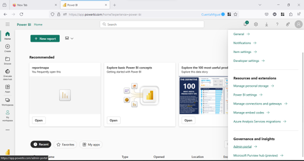

# COMO EMBEBER UN REPORTE EN POWER BI EN UN PROYECTO REACT 

Bienvenidos, este es un turorial de como agregar o implementar un reporte hecho en PowerBi en un sitio web de react.

Inicialmente ingresé a descargar PowerBi Desktop [microsoft.com/download Descargar power bi Desktop desde la página oficial de Microsoft"](https://www.microsoft.com/es-es/download/details.aspx?id=58494 "Descargar power bi Desktop desde la página oficial de Microsoft")

Luego creé una cuenta gratuita de 30 dias de Power Bi [app.powerbi.com](https://app.powerbi.com/admin-portal/capacities/capacitiesList/trial?experience=power-bi "Microsoft Fabric") como heerramienta que nos permitirá publicar o subir reportes de Power Bi en la web y que nos retornará una url para embeber dentro del React

Aqui encontrará un tutorial de como crear un cuenta en power bi gratis 
[youtube.com Cómo iniciar sesión en Power BI Service GRATIS 🤩](https://www.youtube.com/watch?v=upZTyad-brY "Cómo iniciar sesión en Power BI Service GRATIS 🤩")

Debe tener en cuenta esta configuración, para ingresar por favor vaya a **Configuraciones > Admin portal** previamente de publicar el reporte de Power Bi



Luego de esto en **Tenant settings > Publish to web** se debe habilitar la opción **Allow users to create new embed codes** para que le permita a los usuario embeber reportes de Power Bi


>Aqui se encuentra un aticulo de Microsoft con un paso a paso de como agregar el código necesario de como embeber un reporte de power bi en React 
[learn.microsoft.com Inserción de un elemento de Power BI en una aplicación react](https://learn.microsoft.com/es-es/javascript/api/overview/powerbi/powerbi-client-react "Inserción de un elemento de Power BI en una aplicación react") **de igualmanera aqui se deja el código para hacerlo**

Se requiere agregar estas librerias para power implementar reportes de Power Bi 
```typescript
import { PowerBIEmbed } from 'powerbi-client-react';
import { models } from 'powerbi-client'; ```


```typescript
function App() {
  return (
    <div className="App">
      <header className="App-header">
        
        <PowerBIEmbed
          embedConfig = {{
            type: 'report',   
            id: "b8cecad6-e1e5-4a4a-a40b-d8620682492c",
            embedUrl: '',
            accessToken: '',
            tokenType: models.TokenType.Embed,
            settings: {
              panes: {
                filters: {
                  expanded: false,
                  visible: true
                }
              },
              background: models.BackgroundType.Transparent,
            }
          }}

          eventHandlers = {
            new Map([
              ['loaded', function () {console.log('Report loaded');}],
              ['rendered', function () {console.log('Report rendered');}],
              ['error', function (event) {console.log(event.detail);}],
              ['visualClicked', () => console.log('visual clicked')],
              ['pageChanged', (event) => console.log(event)],
            ])
          }

          cssClassName = { "Embed-container" }

          getEmbeddedComponent = { (embeddedReport) => {
            window.report = embeddedReport;
          }}
        />

      </header>
    </div>
  );
}
```
